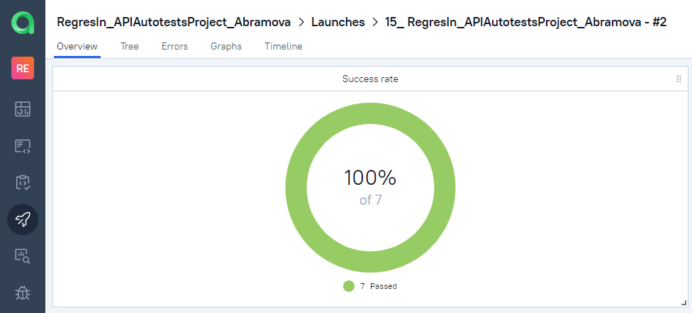
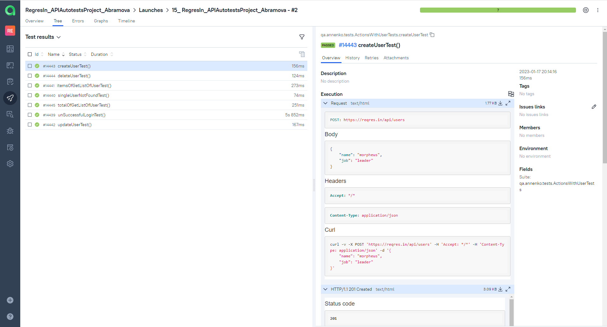
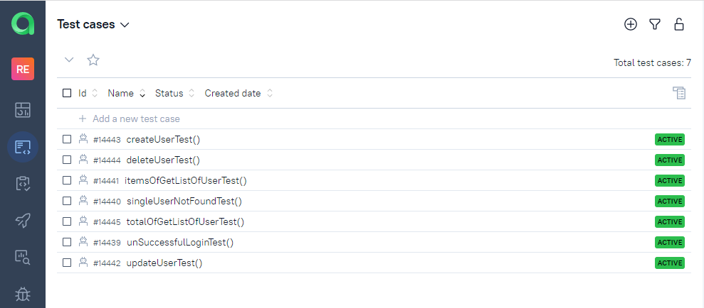
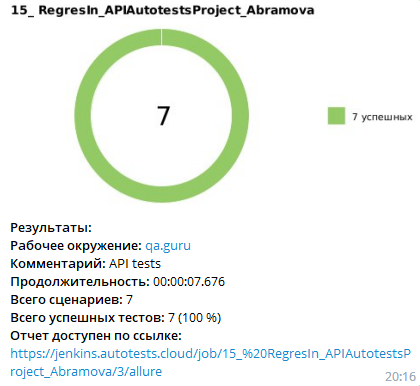

# Проект автоматизации тестирования API на платформе [regres.in](https://reqres.in/)

##	Содержание

- [Технологии и инструменты](#technologist-технологии-и-инструменты)
- [Реализованныe проверки](#bookmark_tabs-реализованные-проверки)
- [Запуск тестов из терминала](#computer-запуск-тестов-из-терминала)
- [Запуск тестов в Jenkins](#-запуск-тестов-в-jenkins)
- [Отчет о результатах тестирования в Allure Report](#-отчет-о-результатах-тестирования-в-Allure-report)
- [Интеграция с Allure TestOps](#-интеграция-с-allure-testops)
- [Уведомления в Telegram с использованием бота](#-уведомления-в-telegram-с-использованием-бота)


## Технологии и инструменты
<p  align="center">

<code></code>
<code></code>
<code></code>
<code></code>
<code></code>
<code></code>
<code></code>
<code></code>
<code></code>
<code></code>

</p>

## Реализованные проверки:

- Создание пользователя
- Удаление пользователя
- Обновление данных пользователя
- Проверка суммарного количества пользователей
- Проверка, что конкретные пользователи добавлены в систему
- Проверка ответа 404, если пользователь не найден
- Проверка получения сообщения об ошибке при некорректном логине

## Запуск тестов из терминала
```bash
gradle clean test 
```
в случае если вы не добавили файл с конфигурацией базового URL (src/test/resources/config/user.properties) вы можете изменить его через команду:
```bash
gradle clean test -DbaseURL=ваш базовый URL
```
##  Запуск тестов в [Jenkins](https://jenkins.autotests.cloud/job/15_%20RegresIn_APIAutotestsProject_Abramova/)

Для запуска сборки необходимо нажать кнопку <code><strong>*Собрать сейчас*</strong></code>.

<p align="center">
  
</p>

После выполнения сборки, в блоке <code><strong>*История сборок*</strong></code> напротив номера сборки отобразятся
иконки *Allure Report* и *Allure TestOPS*, которые по клику открывают страницы соответствующих отчетов.

<p align="center">
  
</p>

##  Отчет о результатах тестирования в [Allure Report](https://jenkins.autotests.cloud/job/15_%20RegresIn_APIAutotestsProject_Abramova/3/allure/)

<p align="center">
  
</p>


##  Интеграция с [Allure TestOps](https://allure.autotests.cloud/launch/18491)

### Основной дашборд

<p align="center">
  
</p>

### Список тестов с результатами прогона

<p align="center">
  
</p>

### Список тест-кейсов, сформированных в результате прогона

<p align="center">
  
</p>

##  Уведомления в Telegram с использованием бота
После завершения сборки специальный бот, созданный в <code>Telegram</code>, автоматически обрабатывает и отправляет сообщение с отчетом о прогоне тестов.

<p align="center">



</p>